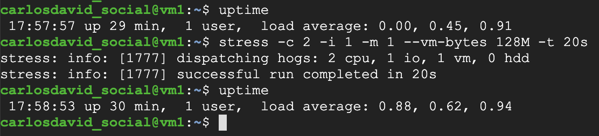
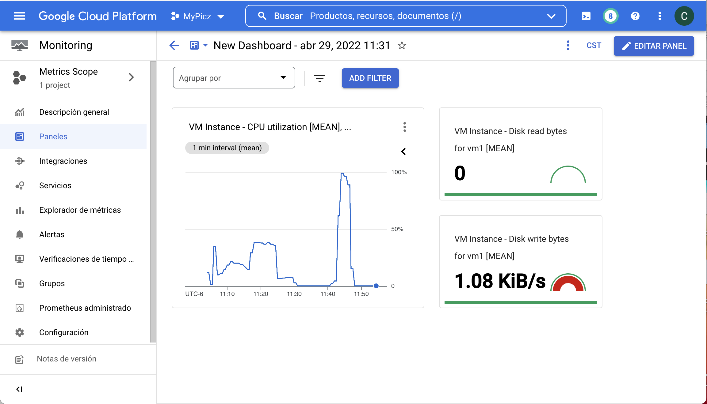
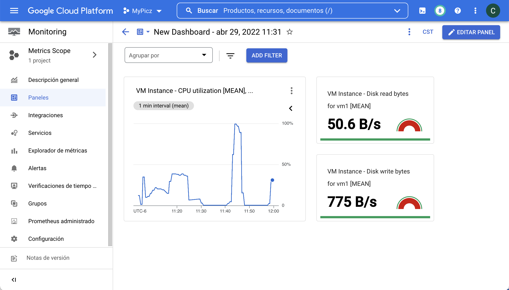
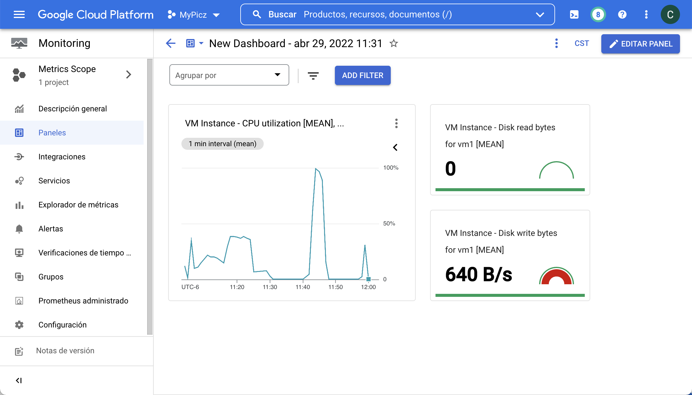

# gcp-t6

```bash
# Hacer el deployment
gcloud deployment-manager deployments create gcp-t6 --config deployment.yaml
gcloud deployment-manager deployments update gcp-t6 --config deployment.yaml

# Instalar el agente de monitoreo
curl -sSO https://dl.google.com/cloudagents/install-monitoring-agent.sh
sudo bash install-monitoring-agent.sh

# Instalar el agente de logging
curl -sSO https://dl.google.com/cloudagents/install-logging-agent.sh
sudo bash install-logging-agent.sh
```

# Usamos stress para probar el dashboard
```sh 
# Instalamos
sudo apt -y install stress

# Ejecutamos
uptime
stress -c 2 -i 1 -m 1 --vm-bytes 128M -t 10s
uptime
```






gcloud services enable deploymentmanager.googleapis.com
gcloud services disable deploymentmanager.googleapis.com